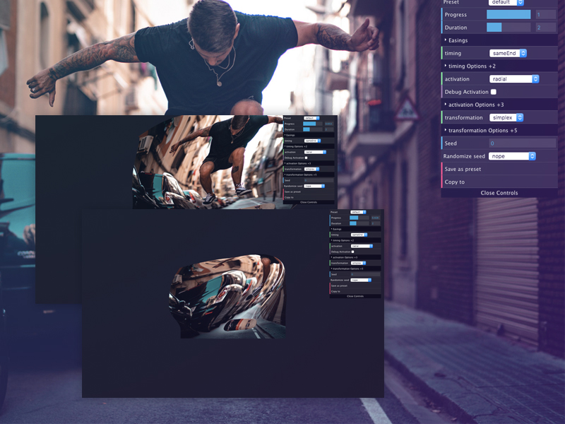

# WebGL Distortion Configurator

A configurator for creating your own grid-to-fullscreen distortions. Made for "A Configurator for Creating Custom Grid to Fullscreen Animations" by Daniel Velasquez.



[Article on Codrops](https://tympanus.net/codrops/?p=40753)

[Demo](https://tympanus.net/Development/WebGLDistortionConfigurator/?default=true)

## Options

Options used to modify the effect and create variations:

```javascript
const options = {
  // Timing of the effect and vertice timing calculation
  duration: 1, // Seconds of the animation
  easings: {
    toFullscreen: Power0.easeNone, // gsap EasePack easing
    toGrid: Power0.easeNone // gsap EasePack easing
  },
  timing: {
    // How to calculate the timing of a vertice
    type: "sameEnd", // "sameEnd" | "sections"
    props: {} // Type specific props
  },
  // Plane transformations
  transformation: {
    type: "none", // "flipX" | "sin" | "simplex" etc...
    props: {} // Type specific props
  },
  // The plane activation used with timing
  activation: {
    type: "sides", // "sides" | "corners" | "radial" | etc...
    props: {} // Type specific props
  },
  // General seed for some effects
  seed: 0, // Number
  randomizeSeed: null, // "itemUnique" | "InOutUnique" | "tweenUnique"
  // Easings for the effects tweens
  debug: {
    activation: false // Display the activation as color
  }
};
```

## Credits

- [three.js](https://threejs.org/) by Ricardo Cabello
- [GSAP](https://greensock.com/) by Jack Doyle
- [imagesLoaded](https://imagesloaded.desandro.com/) by Dave DeSandro
- Images from [Unsplash.com](https://unsplash.com/)

## License

This resource can be used freely if integrated or build upon in personal or commercial projects such as websites, web apps and web templates intended for sale. It is not allowed to take the resource "as-is" and sell it, redistribute, re-publish it, or sell "pluginized" versions of it. Free plugins built using this resource should have a visible mention and link to the original work. Always consider the licenses of all included libraries, scripts and images used.

## Misc

Follow Daniel: [Twitter](https://twitter.com/Anemolito), [Codepen](https://codepen.io/Anemolo/), [CodeSandbox](https://codesandbox.io/u/Anemolo), [GitHub](https://github.com/Anemolo)

Follow Codrops: [Twitter](http://www.twitter.com/codrops), [Facebook](http://www.facebook.com/codrops), [Google+](https://plus.google.com/101095823814290637419), [GitHub](https://github.com/codrops), [Pinterest](http://www.pinterest.com/codrops/), [Instagram](https://www.instagram.com/codropsss/)

[© Codrops 2019](http://www.codrops.com)
